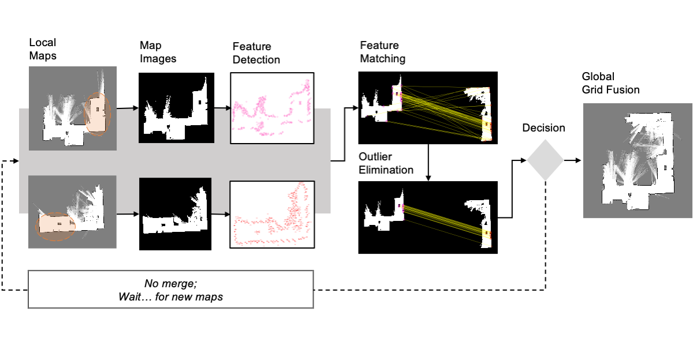

# Feature-Based Occupancy Map-Merging for Collaborative SLAM
Given two overlapping 2-dimensional occupancy grid maps, the occupancy-grid-map-fusion aims to find an association between the independent maps and combine them. One of the heuristic solutions to this map fusion problem is to use computer vision techniques. The figure below gives an overview.
 


### About the implementation:
- This is a simple Matlab implementation that requires a Computer Vision Toolbox.
- The code is only for demonstration; some parts may be inefficient. 
- To get started, just run: 
```
Occupancy-Grid-Map-Fusion/mapFusionMAIN.m
```
If you would like more details, please refer to the [MDPI journal](https://www.mdpi.com/1424-8220/23/6/3114).
